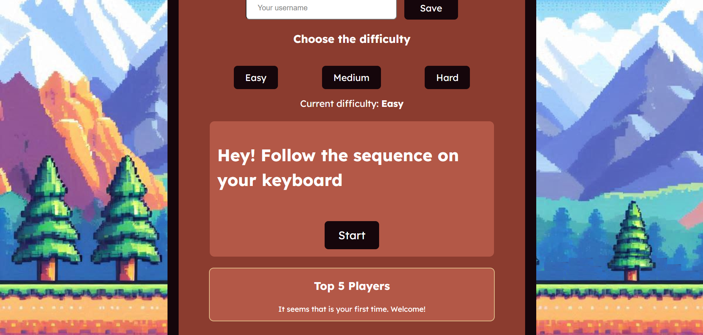
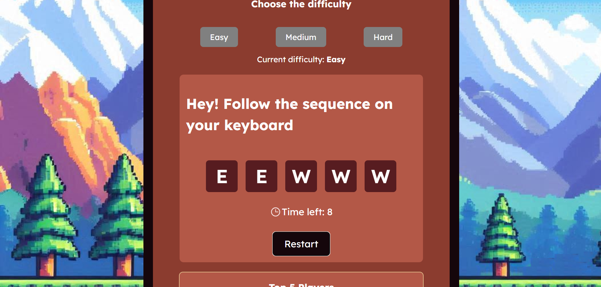
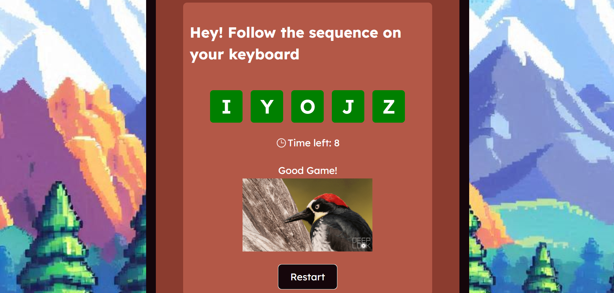
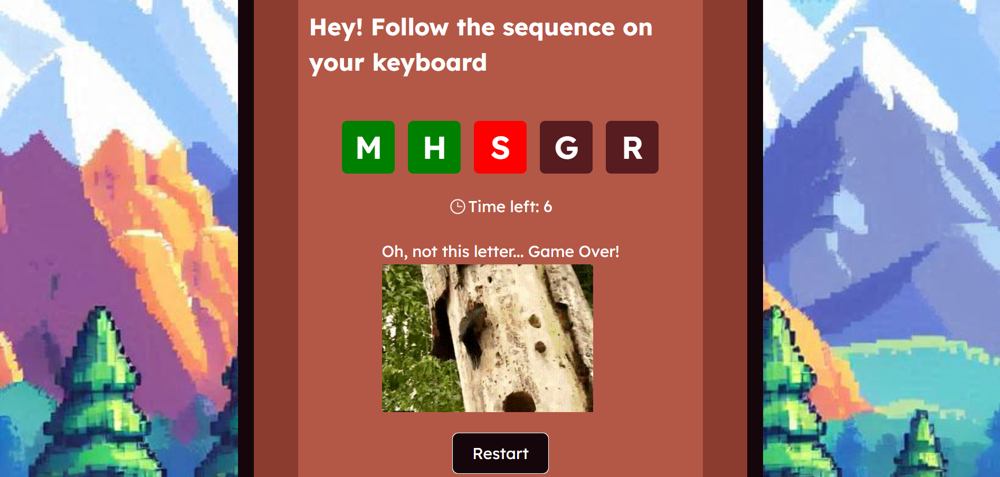
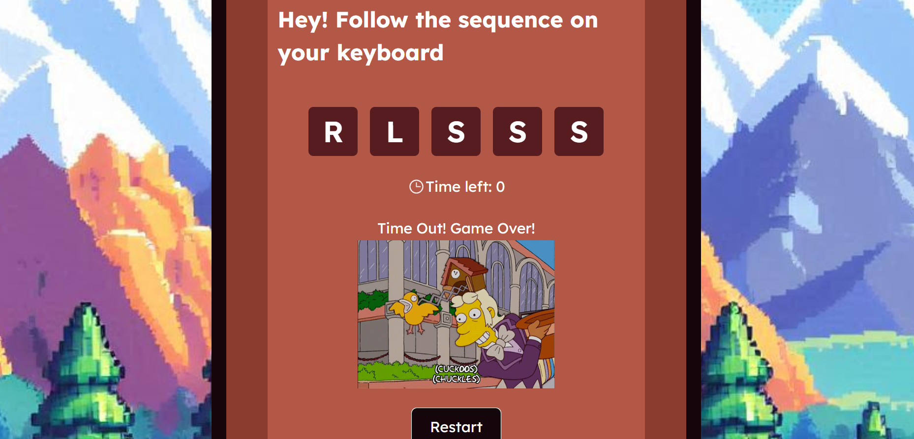
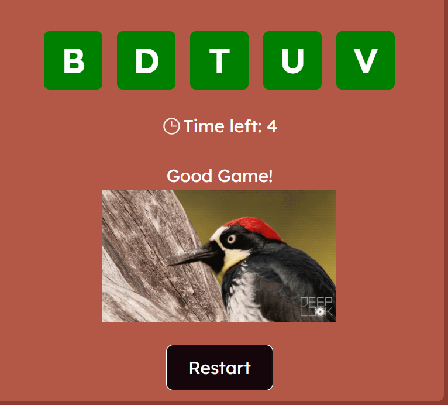
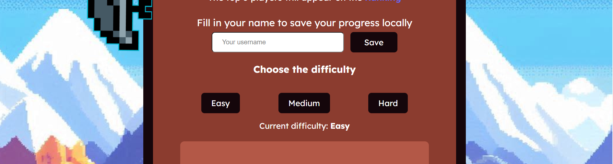
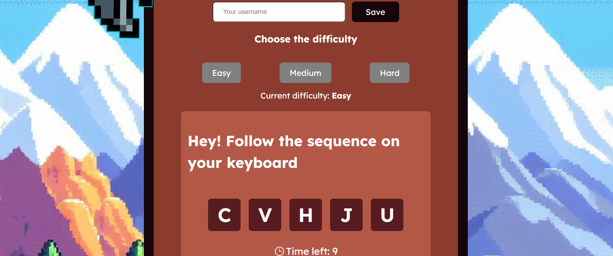
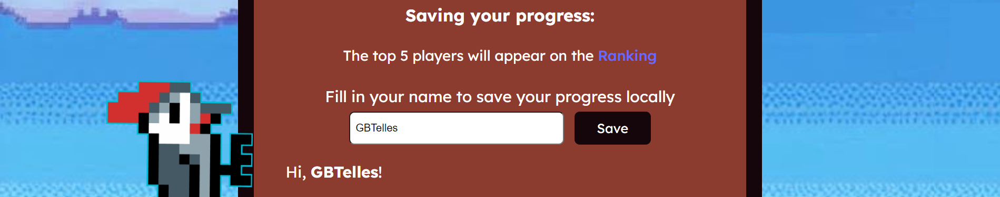
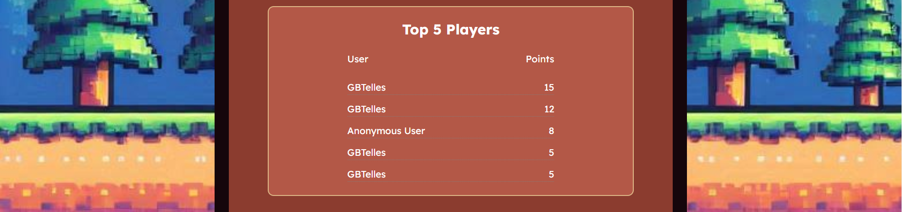

[PT-BR]
# Woodclicker Minigame
Bem-vindo ao Woodclicker! Tudo que você precisa fazer é seguir a sequência de letras no seu teclado para ajudar o pica-pau a encontrar alguns deliciosos insetos para o almoço!

# Tecnologias
- React 18
- Vite
- Typescript

# Executando o projeto
Após clonar o repositório, você precisa instalar as dependências executando:
```bash
npm install
```
Depois, execute o projeto com:
```bash
npm run dev
```

# Instruções do Jogo
## Objetivo:
Pressione as teclas na sequência exibida antes que o tempo acabe.

## Como Jogar:
Inicie o Jogo: O jogo começa ao pressionar o botão de Start, então uma sequência de letras será exibida na tela.
<details>
  <summary>Clique aqui para ver uma imagem desse botão</summary>
  
</details>
Pressione as Teclas: Pressione as teclas no seu teclado que correspondem às letras na sequência.
<details>
  <summary>Clique aqui para ver uma imagem da sequência</summary>
  
</details>

Condição de Vitória: Pressione todas as letras na sequência antes que o tempo acabe.
<details>
  <summary>Clique aqui para ver uma imagem ganhando o jogo</summary>
  
</details>
Condição de Derrota: Se você pressionar uma tecla errada ou o tempo acabar, o jogo termina e você perde.
<details>
  <summary>Clique aqui para ver uma imagem errando uma letra, perdendo o jogo</summary>
  
</details>
<details>
  <summary>Clique aqui para ver uma imagem esgotando o tempo, perdendo o jogo</summary>
  
</details>

## Controles:
Todas as letras do seu teclado.

## Feedback:
Letras Verdes: Letras pressionadas corretamente ficam verdes.
Letras Pretas: Letras ainda não pressionadas permanecem marrons.
Letras Vermelhas: Se você pressionar uma letra errada, a letra atual no jogo ficará vermelha.

## Reiniciar:
Pressione o botão de Restart para gerar outra sequência de letras e jogar novamente.
Esse botão só aparece após iniciar o jogo.
<details>
  <summary>Veja aqui como esse botão aparece</summary>
  
</details>

## Dificuldade do Jogo:
Há 3 níveis de dificuldade, cada um com seu próprio timer:
- Fácil: 10 segundos para vencer o jogo
- Médio: 8 segundos para vencer o jogo
- Difícil: 6 segundos para vencer o jogo
Inicialmente e sempre que atualizar a página, a dificuldade será (re)definida como Fácil.
Para alterá-la, use os botões com os nomes das dificuldades.
A dificuldade atual será exibida abaixo dos botões.
<details>
  <summary>Clique aqui para ver os botões dos níveis de dificuldade</summary>
  
</details>
Não é possível mudar o nível de dificuldade durante o jogo.
<details>
  <summary>Clique aqui para ver como ficam os botões de dificuldade durante o jogo</summary>
  
</details>

## Salvamento Local:
Todos os jogos serão salvos localmente quando o jogo terminar.
Você pode dar um nome de usuário e pressionar o botão "Salvar" ao lado do próprio input para salvar o progresso do jogo com o nome dado.
<details>
  <summary>Veja aqui um exemplo</summary>
  
</details>
Se nenhum nome for fornecido, o progresso será salvo como "Anonymous User".
<details>
  <summary>Veja aqui como aparecem os progressos salvos no Ranking, com os top 5 players</summary>
  
</details>
Sempre que atualizar a página, o nome de usuário (se fornecido) será resetado.

## Observações:
Este minijogo foi feito para PCs (também é possível jogá-lo em um tablet), pois você precisa de um teclado para jogar.
Portanto, ele não tem suporte para a maioria dos dispositivos móveis, apenas para dispositivos com largura entre 680px e 2000px.
----------------------------------------------------------------------------------------------------------------------
[EN]
# Woodclicker Minigame
Welcome to the Woodclicker! All you need to do is follow the letter sequence on your keyboard to help the woodpecker find some delicious insects for lunch!

# Technologies
- React 18
- Vite
- Typescript

# Running the project
After cloning the repository, you need to install the dependencies by running:
```bash
npm install
```
Then just run the project with:
```bash
npm run dev
```

# Game Instructions
## Objective:
Press the keys in the displayed sequence before time runs out.

## How to Play:
Start the Game: The game begins by pressing the start button, then a sequence of letters will be displayed on the screen.
Press Keys: Press the keys on your keyboard that correspond to the letters in the sequence.

Win Condition: Successfully press all letters in the sequence before the time runs out.
Lose Condition: If you press a wrong key or time runs out, the game ends.

## Controls:
All the letters on your keyboard.

## Feedback:
Green Letters: Correctly pressed letters will turn green.
Black Letters: Letters not yet pressed remain brown.
Red Letters: If you press a wrong letter, the current one on the game will turn red.

## Restart:
Press the restart button to generate another letter sequence and play again.

## Game Difficulty:
There are 3 levels of difficulty, each one with its own timer:
- Easy: 10 seconds to win the game
- Medium: 8 seconds to win the game
- Hard: 6 seconds to win the game
At first and anytime you refresh the page, the difficulty will be set to Easy.
To change it, use the buttons with the difficulties name.
The current difficulty will be displayed bellow the buttons.
It's not possible to change difficulty level during the game

## Local Save:
All the games will be saved locally as the game ends.
You can give a username and press the "Save" button next to the input element to save the game progress with the given name. If no name was given, the progress will be save with "Anonymous User".
Every time you refresh the page, the username (if given) will be reset.

## Observations:
This minigame was made to PCs (also possible to play it on a tablet), because you need a keyboard to play it.
So it doesn't have support for the most common mobile devices, only for devices with width between 680px and 2000px.
